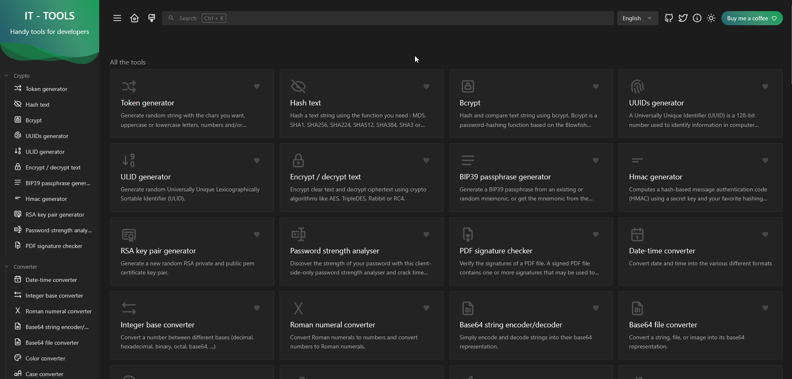
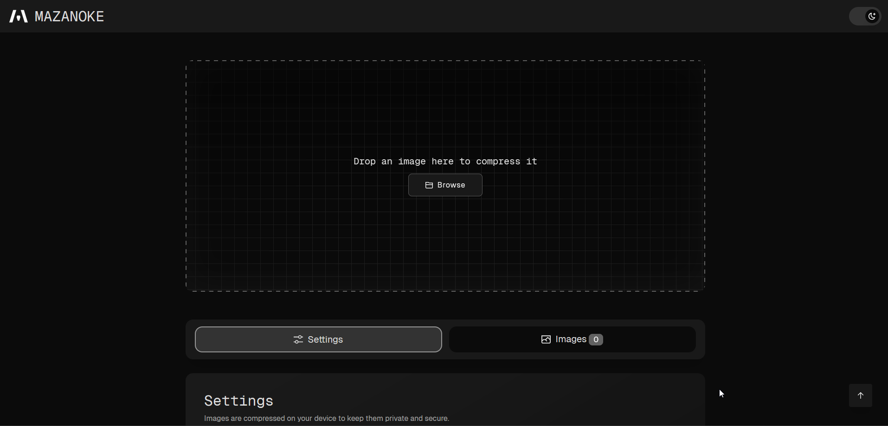
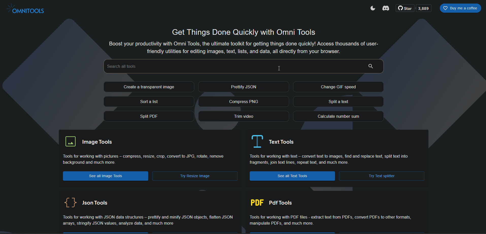
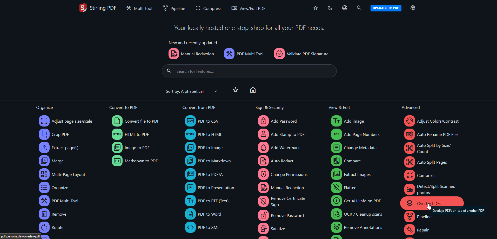

[ IT-Tools](https://ittools.perrone.dev "Title") - Useful tools for developer and people working in IT. - [Github](https://github.com/CorentinTh/it-tools "Title")
{.center}
---

[ Mazanoke](https://mazanoke.perrone.dev "Title") - Local image optimizer that runs in your browser. - [Github](https://github.com/civilblur/mazanoke "Title")
{.center}
---

[ Omni-Tools](https://omnitools.perrone.dev "Title") - Collection of powerful web-based tools for everyday tasks. - [Github](https://github.com/iib0011/omni-tools "Title")
{.center}
---

[ Stirling PDF](https://pdf.perrone.dev "Title") - Web application that allows you to perform various operations on PDF files. - [Github](https://github.com/Stirling-Tools/Stirling-PDF "Title")
{.center}
